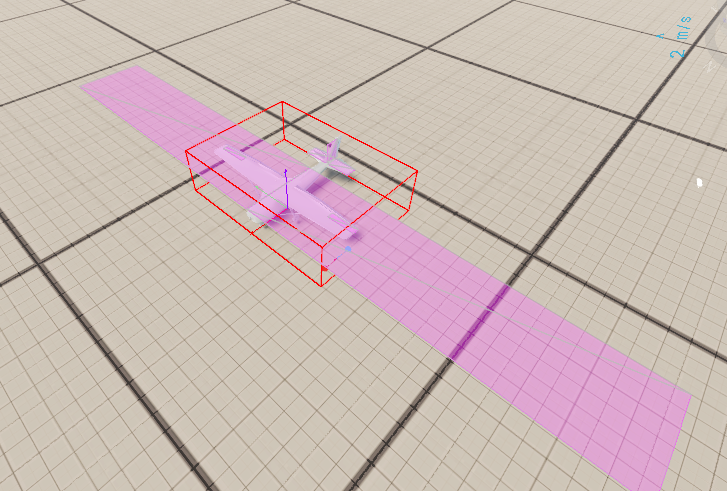

# Building a Variant

PFC is meant to be a base. To make your own propeller aircraft, depend on the core and build a prefab the
same way the Cessna does, then add only the systems your aircraft needs.

## 1. Add PFC as a dependency

In your mod's `addon.gproj`, add the PFC GUID to `Dependencies`:

```text
Dependencies {
  "69A8A34027DA65C5"   // Propeller flight core
  // ...the base game dependency is pulled in transitively
}
```

This makes all `PFC_*` classes and the merged input actions available to your mod.

## 2. Create the aircraft prefab

Create a prefab inheriting `Wheeled_Base.et` and add the core components (mirror the
[Cessna setup](prefab-setup.md)):

1. `MeshObject` → your aircraft model.
2. `PFC_FlightController` - tune the slew rates / `m_fGroundSteerScale` for your airframe.
3. `PFC_FlightModel` - set engine count/thrust, then define your aero surfaces in `m_aSurfaceDefs`.

## 3. Lay out the aero surfaces

Place a `PFC_AeroSurfaceDef` for each lifting/control surface. Start from the Cessna values and scale to your
aircraft:

- **Main wing** - `m_iControlAxis NONE`, `m_bMirror 1`, set `m_fAspectRatioOverride` to the real wing AR.
- **Ailerons** - `AILERON`, `m_bMirror 1`, out near the wingtips (large X) for roll authority.
- **Elevator** - `ELEVATOR`, `m_bMirror 1`, well aft (large −Z) for pitch authority.
- **Rudder** - `RUDDER`, `m_bMirror 0`, `m_vRotation 0 0 90` (vertical surface), aft.
- **Fuselage side** - `NONE`, vertical, low lift slope + low efficiency, for yaw/side damping.

!!! tip "Tune with debug draw on"
    Enable **F6 → Prop Flight → Debug draw** (or set `m_bDebugDraw`) to see each surface's position, extent,
    and live force vector. Use **Setup approach** to jump straight to altitude and test handling.



## 4. Add your own systems on top

The core deliberately stops at flight. Anything else is a component you add to your prefab - for example:

- Gear / flap / trim controllers that drive their own surfaces or animation variables.
- A start sequence, fuel, or systems controller (the core's engine is always on).
- Cockpit instruments / a custom HUD reading the [instrument signals](reference.md#instrument-signals).
- Cargo, weapons, lights, etc.

Follow the core's networking patterns when you do: owner-authoritative changes via RPC, and guard per-tick
RPCs / MP-signal writes on a valid Rpl id (see [Networking & MP](networking.md#boot-window-guard)).

## 5. Wire control hints (optional)

If you add actions, extend `Configs/ControlHints/AvailableActions.conf` - and remember the **base-GUID rule**
applies to both the input config and the control-hints config (see
[Input & Controls](input-and-controls.md#the-carcontext-merge-guid-pitfall)).
