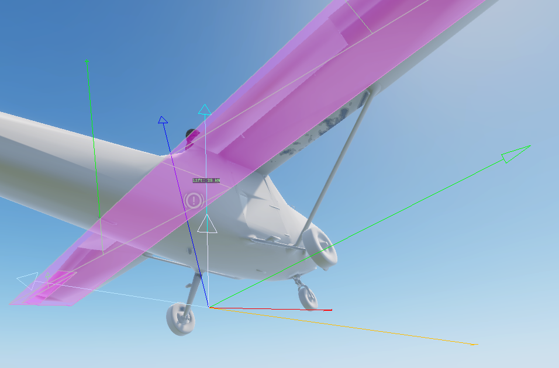

# Flight Model

`PFC_FlightModel` is where the aircraft is simulated. This page explains how each part works; the
[Reference](reference.md) page lists every tunable attribute with its default.

## Per-surface aerodynamics

The model is force-based: instead of one set of stability derivatives, the aircraft is described as a list of
**aero surfaces** (`PFC_AeroSurfaceDef` entries in the prefab). Each tick, for every surface:

1. The aircraft's airflow (velocity relative to the air mass) is transformed into the surface's local space.
   The `GetSurfaceAirVelocityLS()` hook decides what airflow a surface sees — the core passes every surface
   the CoM airflow; a variant can add the rotational component (ω × r) for physical pitch/yaw/roll damping.
2. `PFC_AeroSurface.CalculateForce()` computes lift and drag from the local angle of attack.
3. The resulting force is applied as an impulse **at the surface's position** via `ApplyImpulseAt`, so it
   produces the correct moment about the centre of mass (a tail surface pitches, a wingtip aileron rolls).

### Lift & drag (Khan & Nahon 2015)

`PFC_AeroSurface` uses a linear lift curve pre-stall, blended into a flat-plate model post-stall:

- **Pre-stall**: `Cl = liftSlope · (α − α₀)` between the negative and positive stall angles.
- **Post-stall**: blends to `Cl = 2·sin(α)·cos(α)` over a 15° window past the stall angle.
- **Drag**: skin friction + induced drag `Cl²/(π·AR·e)` + a post-stall `sin²(α)` term.

Control surfaces add their deflection to the effective angle of attack scaled by `m_fFlapFraction` (the
fraction of the chord that is the moving control), so a larger flap fraction = more control authority per
degree of deflection.



## Control surfaces

Each surface's `m_iControlAxis` decides what drives its deflection:

| Axis | Driven by | Deflection |
|---|---|---|
| `NONE` | - | fixed (e.g. main wing, fuselage side) |
| `ELEVATOR` | pitch input | `−pitch · maxDef` |
| `AILERON` | roll input | `−roll · maxDef` (mirrored panel flips sign) |
| `RUDDER` | yaw input | `−yaw · maxDef` |
| `FLAPS` | flap angle | `m_fCurrentFlapAngle` |

`maxDef` is `m_fMaxControlDeflectionDeg` (default 25°).

The axis→deflection mapping lives in the `GetSurfaceDeflection()` hook. A variant can override it to scale
authority (e.g. high-speed control stiffening) or to serve extra axes added via `modded enum
PFC_ControlAxis` (e.g. an airbrake); returning `false` leaves a surface undriven.

!!! info "No flap controller in the core"
    The minimal core never deploys flaps - `m_fCurrentFlapAngle` stays 0. A `FLAPS` surface still resolves
    correctly; a variant adds a controller to drive the flap angle.

## Engine & thrust

The engine is **always on**. Each tick the per-engine RPM ramps toward `idle + throttle·(max−idle)` at
`m_fRPMRate` (fraction of max RPM per second), then thrust is:

```text
thrustFraction = clamp((RPM − idle) / (max − idle), 0, 1)   // 0 at idle, 1 at max
thrust = thrustFraction · m_fMaxThrustPerEngine · numEngines · healthMul
```

Thrust is applied along the aircraft's forward axis at the centre of mass. Damage scales power down to
`m_fMinHealthThrustFraction` of full at zero hull health; a destroyed aircraft makes zero thrust and its RPM
snaps to zero.

Both halves are hooks: `UpdateEngineSpool()` owns the RPM ramp and `ComputeThrustMagnitude()` owns the
thrust formula (with `GetThrustHealthMultiplier()` for the damage scaling), so a variant can substitute e.g.
turbojet spool lag, idle residual thrust, or altitude thrust lapse without touching the rest of the tick.
The fuselage drag term is likewise `GetFuselageDragArea()` — a variant can grow it with speed (transonic
drag rise) or an airbrake.

## Angular damping

A speed-scaled angular-rate damping bleeds angular velocity each tick:

```text
speedFactor = clamp(speed / 80, 0.1, 1.5)
angVel *= 1 − min(m_fAngularDamping · speedFactor · dt, 1)
```

Real aerodynamic damping scales with airspeed; a constant damper would kill low-speed authority yet be too
weak when fast, so the factor scales it with speed. This is the core's stability aid - keep it modest so it
doesn't fight control inputs.

## Wind & gusts

Aerodynamic forces act on **airspeed** (velocity relative to the air mass), computed by subtracting the wind
from ground velocity. Consequences:

- A crosswind produces sideslip and weathervaning.
- A head/tailwind separates indicated airspeed from groundspeed.

Wind is assembled on the authoritative peer only (so it never needs replicating):

- **Steady wind** is read from the weather manager a few times a second, scaled by `m_fWindScale`.
- **Near-ground gradient** eases the wind from `m_fWindSurfaceFraction` at the deck up to full at
  `m_fWindGradientHeight` AGL - a boundary layer, so the crosswind shears as you descend on approach.
- **Gusts** add smooth time-varying turbulence scaled by `m_fGustIntensity` (and `m_fGustVerticalScale` for
  the vertical component), so calm air stays calm.

## Instrument signals

When the owner is registered for replication, `UpdateSignals()` publishes the standard vanilla gauge signals
(names match `VehicleGauge_*.conf` expectations). These drive HUDs and cockpit instruments and replicate to
all peers. See the [Reference](reference.md#instrument-signals) for the full list.

!!! danger "Signal compression"
    Raw-unit signals (airspeed in km/h, altitude in m, climb in m/s) **must** use
    `SignalCompressionFunc.None`. `Range01` clamps the value to `[0,1]` over the network, which silently
    pins every raw signal at `1` on the receiving side. Only already-normalized 0..1 signals (throttle,
    normalized RPM) may use `Range01`.

## Robustness guards

A Game-Master lift/teleport or a solver penetration spike can hand the rigid body a non-finite or enormous
velocity in a single frame. Left in the body, that overflows the solver next step and hard-crashes the
engine. `PFC_FlightModel` therefore:

- Resets velocity + angular velocity and bails the tick on a clearly-broken (NaN / absurd-magnitude) value.
- Clamps a finite-but-implausible teleport spike (body speed > 600 m/s, angular > 40 rad/s, airspeed >
  400 m/s) before it reaches the solver, leaving normal flight untouched.
- Sanitizes every value written to a signal (`SafeNum`), since a NaN reaching a gauge trips `!BadFloat()`
  asserts in every consumer and can take down the whole HUD.
