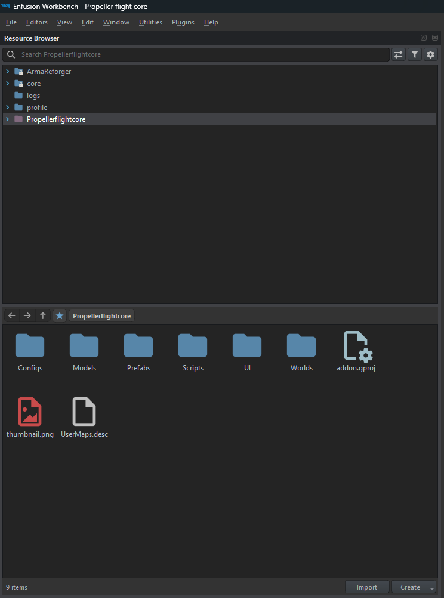
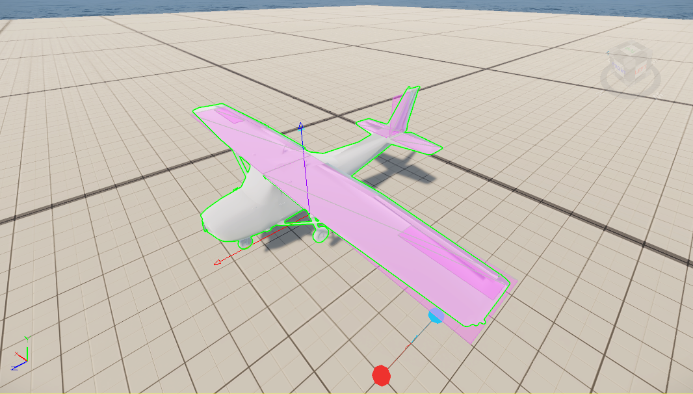

# Getting Started

This page gets the PFC project open, flying in the test world, and shows the debug tooling you'll use while
working on the flight model.

## Open the project

1. Launch the **Arma Reforger Tools** Workbench.
2. Open the **Propeller flight core** addon (`addon.gproj`, GUID `69A8A34027DA65C5`).
3. The mod depends on the Arma Reforger core (`58D0FB3206B6F859`), which Workbench resolves automatically.



## Fly it in the test world

Open `Worlds/MP_Test.ent` and enter Play mode, then get into the Cessna 172.

Default keyboard controls (full list on [Input & Controls](input-and-controls.md)):

| Action | Key |
|---|---|
| Pitch | ++w++ / ++s++ (or ++up++ / ++down++) |
| Roll | ++a++ / ++d++ (or ++left++ / ++right++) |
| Yaw | ++q++ / ++e++ |
| Throttle up / down | ++shift++ / ++ctrl++ |

The engine is always on - roll in throttle, build up speed on the runway, and ease back on pitch to rotate.

## Debug overlay

PFC registers a debug menu under **F6 → Prop Flight**:

- **Debug draw** - draws body axes, per-surface force arrows and surface extents, the velocity/flight-path
  vector, the wind vector, the net-lift arrow, and a live data panel (AoA, pitch, flight-path angle, IAS,
  vertical speed, G-loads, wind speed).
- **Setup approach** - teleports the aircraft 1000 m up, points it into a gentle left bank at ~50 m/s with
  full throttle, for quickly testing handling without a manual climb.

!!! tip "Turn debug draw on at spawn"
    Set `m_bDebugDraw` to `true` on the `PFC_FlightModel` component in the prefab to have the overlay enabled
    from the start, instead of toggling it via F6 each run.



## Repository layout

```text
Propeller flight core/
├── addon.gproj
├── Configs/
│   ├── ControlHints/AvailableActions.conf   # control hints (merges into the vanilla resource - see Input page)
│   ├── ProcAnims/PFC_Propeller.pap|siga      # propeller spin procedural anim
│   ├── System/chimeraInputCommon.conf        # shared Airplane_ input actions merged into CarContext
│   └── System/keyBindingMenu.conf            # the "Airplane" controls tab
├── Models/                                   # Cessna172.xob, prop.xob
├── Prefabs/Vehicles/Cessna172.et             # reference airframe (inherits Wheeled_Base.et)
├── Scripts/Game/
│   ├── Utilities/PFC_PilotUtil.c
│   └── Vehicle/
│       ├── PFC_AeroSurface.c                 # single-panel lift/drag math
│       ├── PFC_AeroSurfaceConfig.c           # runtime aero params
│       ├── PFC_AeroSurfaceDef.c              # editable surface definition (+ mirror)
│       ├── PFC_FlightController.c            # pilot input → smoothed control values
│       ├── PFC_FlightModel.c                 # the flight model (forces, thrust, signals)
│       ├── PFC_FreeLookController.c          # device-aware cockpit free look
│       └── PFC_NwkMovementComponent.c        # owner → proxy state replication
├── UI/layouts/HUD/PFC_VehicleHUD.layout
└── Worlds/MP_Test.ent
```
