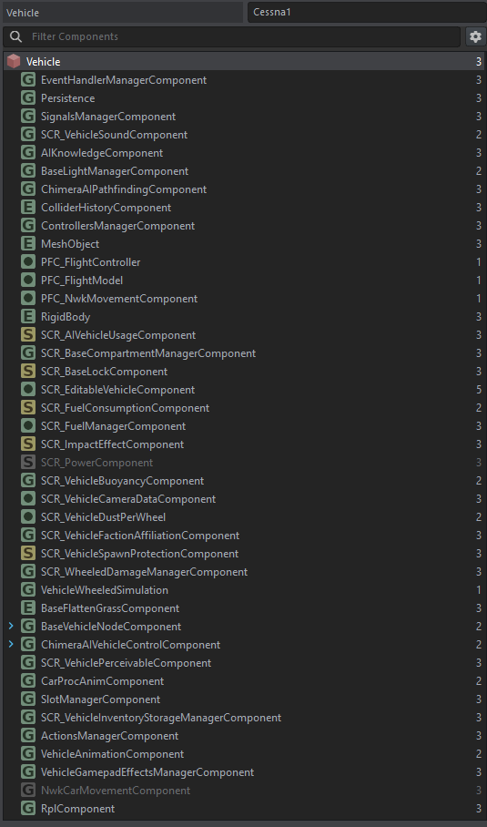

# Prefab Setup

The reference airframe is `Prefabs/Vehicles/Cessna172.et`. This page walks its structure - the same recipe
you'll follow to build a [variant](building-a-variant.md).

## Inheritance & components

The prefab inherits the vanilla `Wheeled_Base.et` (`62F416029692CE40`) and adds:

```text
Vehicle : Wheeled_Base.et
├── MeshObject                 → Models/Cessna172.xob
├── PFC_FlightController        (input smoothing, ground steering)
└── PFC_FlightModel             (the flight model + aero surface defs)
    └── m_aSurfaceDefs[]         (Wing, Aileron, Elevator, Rudder, ...)
```



## Aero surface definitions

Surfaces live in `PFC_FlightModel.m_aSurfaceDefs` as `PFC_AeroSurfaceDef` entries. Set `m_bMirror` to spawn
an X-mirrored counterpart automatically (the left/right wing, elevator halves, etc.); ailerons flip their
deflection sign on the mirrored side so they act differentially.

The Cessna's main wing, for example:

```text
PFC_AeroSurfaceDef "Wing" {
  m_vPosition 2.75 2 0.5      // local position (m); mirror negates X
  m_vRotation 0 0 0           // yaw pitch roll (deg) → resolves normal + forward axes
  m_bMirror 1
  m_iControlAxis NONE         // fixed surface
  m_fChord 1.47
  m_fSpan 5.5
  m_fLiftSlope 5.7
  m_fStallAngleHigh 16
  m_fStallAngleLow -16
  m_fAspectRatioOverride 7.4  // use the whole-wing AR for induced drag, not the per-panel value
}
```

See the [Reference](reference.md#pfc_aerosurfacedef) for every field. Use **F6 → Prop Flight → Debug draw**
to see each surface's position, extent, and live force while tuning.

!!! tip "Aspect-ratio override"
    When a wing is split into several panels, the per-panel span/chord gives an unrealistically low aspect
    ratio and far too much induced drag. Set `m_fAspectRatioOverride` to the real full-wing AR so induced
    drag is computed correctly.

## Neutralizing the wheeled sim

Flying on a car base only works if the wheeled simulation is properly defanged. These are the settings that
matter:

- **Power/torque ~0** - the car engine must not drive the wheels; all motion comes from the flight model.
- **`HasHandbrake 0` + low `BrakeTorque`** - a flight model on `Wheeled_Base` otherwise sits stuck on the
  runway, because the handbrake stays engaged while `CarThrust` is 0. This is a handbrake problem, *not* a
  grip/friction problem.
- **Reuse the vanilla wheeled-sim template GUIDs** - the wheeled simulation's axle/suspension/wheel entries
  must reuse the vanilla template's GUIDs and override the wheels by name (`Wheel_L01`/`R01`/`L02`/`R02`).
  Giving them fresh GUIDs is a known cause of Game-Master crashes and a stiff/unflyable airframe.
- Runtime key zeroing (`CarThrust`/`CarBrake`/`CarShift`) is handled in script - see
  [Input & Controls](input-and-controls.md#ground-steering-key-de-conflicting).

## Procedural propeller animation

`Configs/ProcAnims/PFC_Propeller.pap` (+ `.siga`) drives the propeller bone from the `PropellerAngle_1`
signal that the flight model integrates from RPM each frame. Bind your prop bone to it in the model's
procedural-animation setup.
